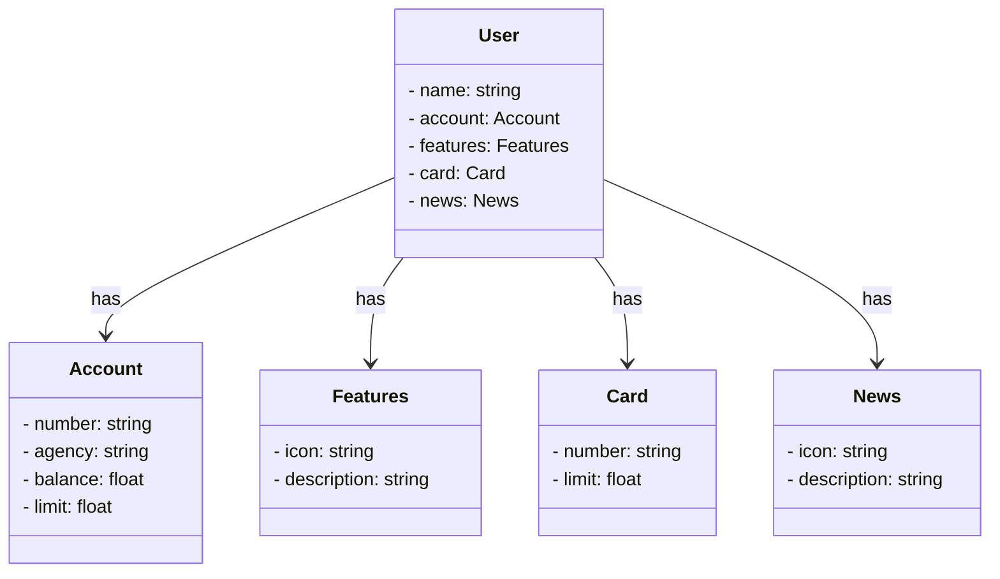

## Diagrama de Classes

```mermaid
classDiagram
  class User {
    - name: string
    - account: Account
    - features: Features
    - card: Card
    - news: News
  }

  class Account {
    - number: string
    - agency: string
    - balance: float
    - limit: float
  }

  class Features {
    - icon: string
    - description: string
  }

  class Card {
    - number: string
    - limit: float
  }

  class News {
    - icon: string
    - description: string
  }

  User --> Account : has
  User --> Features : has
  User --> Card : has
  User --> News : has
```