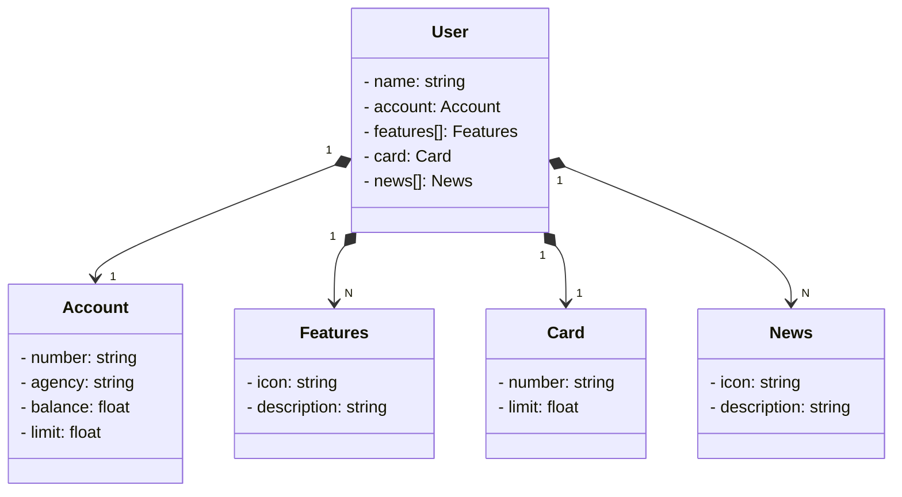

# API REST - Bootcamp Santander Java 2023 
- API RESTfull para uma aplicação bancária que salva informações do usuário como nome e dados bancários desenvolvida no último lab project juntamente com o instrutor. 
- Essa API realiza, até o momento, dois métodos do padrão CRUD: CREATE e READ.
- Deploy na plataforma Railway: [Acesse pelo Swagger UI](https://bootcamp-java-dio-prd.up.railway.app/swagger-ui/index.html)

## Principais Ferramentas Uitilizadas
- **Java 17**
- **Spring Boot 3**
- **Spring Data JPA**
- **PostgreSQL:** provisionado no Railway
- **Railway:** plataforma para deploy e monitoramento, garantindo os bancos de dados como serviço e pipelines de CI/CD.
- **Json Editor:** utilizado na modelagem do modelo de negócio.
- **ChatGPT:** para modelagem do diagrama de classes utilizando a linguagem mermaid
  
## Testando os métodos POST e GET
Para testar, utilize a estrutura JSON abaixo, alterando os valores respectivos:
```
{
  "name": "Nome Usuário",
  "account":{
    "number": "numero conta",
    "agency": "numero agencia",
    "balance": valor do saldo,
    "limit": valor do limite
  },
  "features":[
    {
    "icon": "URL da feature",
    "description":"descrição da feature"
  }
],
  "card":{
    "number": "numero do cartao",
    "limit": limite do cartao
  },
  "news": [
  {
    "icon": "URL das notificações de noticias do app",
    "description":"descrição da notícia"
  }
  ]
}
```
## Diagrama de Classes



